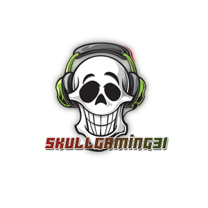

<div id="top"></div>
<!--
*** Thanks for checking out the Best-README-Template. If you have a suggestion
*** that would make this better, please fork the repo and create a pull request
*** or simply open an issue with the tag "enhancement".
*** Don't forget to give the project a star!
*** Thanks again! Now go create something AMAZING! :D
-->

<!-- PROJECT SHIELDS -->
<!--
*** I'm using markdown "reference style" links for readability.
*** Reference links are enclosed in brackets [ ] instead of parentheses ( ).
*** See the bottom of this document for the declaration of the reference variables
*** for contributors-url, forks-url, etc. This is an optional, concise syntax you may use.
*** https://www.markdownguide.org/basic-syntax/#reference-style-links
-->

<!-- 
BOT- https://id.twitch.tv/oauth2/authorize?response_type=code&client_id=dieihxdt0wezh4kgveyiogn3sjii5p&redirect_uri=http://localhost:3001/api/auth/twitch/callback&scope=chat%3Aedit%20chat%3Aread%20moderation%3Aread
USER- https://id.twitch.tv/oauth2/authorize?response_type=code&client_id=dieihxdt0wezh4kgveyiogn3sjii5p&redirect_uri=http://localhost:3001/api/auth/twitch/callback&scope=bits%3Aread%20channel%3Aedit%3Acommercial%20channel%3Amanage%3Abroadcast%20channel%3Amanage%3Apolls%20channel%3Amanage%3Apredictions%20channel%3Amanage%3Aredemptions%20channel%3Amanage%3Aschedule%20channel%3Amanage%3Amoderators%20channel%3Amanage%3Araids%20channel%3Amanage%3Avips%20channel%3Aread%3Avips%20channel%3Aread%3Apolls%20channel%3Aread%3Apredictions%20channel%3Aread%3Aredemptions%20channel%3Aread%3Aeditors%20channel%3Aread%3Agoals%20channel%3Aread%3Ahype_train%20channel%3Aread%3Asubscriptions%20channel_subscriptions%20clips%3Aedit%20moderation%3Aread%20moderator%3Amanage%3Aautomod%20moderator%3Amanage%3Ashield_mode%20moderator%3Amanage%3Ashoutouts%20moderator%3Aread%3Ashoutouts%20moderator%3Aread%3Afollowers%20moderator%3Aread%3Ashield_mode%20user%3Aedit%20user%3Aedit%3Afollows%20user%3Amanage%3Ablocked_users%20user%3Aread%3Ablocked_users%20user%3Aread%3Abroadcast%20user%3Aread%3Aemail%20user%3Aread%3Afollows%20user%3Aread%3Asubscriptions%20user%3Aedit%3Abroadcast
-->

<!-- bot scopes- chat:edit chat:read moderation:read -->


<!-- 
USER SCOPES-
bits:read channel:edit:commercial channel:manage:broadcast channel:manage:polls channel:manage:predictions channel:manage:redemptions channel:manage:schedule channel:manage:moderators channel:manage:raids channel:manage:vips channel:read:vips channel:read:polls channel:read:predictions channel:read:redemptions channel:read:editors channel:read:goals channel:read:hype_train channel:read:subscriptions channel_subscriptions clips:edit moderation:read moderator:manage:automod moderator:manage:shield_mode moderator:manage:shoutouts moderator:read:shoutouts moderator:read:followers moderator:read:shield_mode user:edit user:edit:follows user:manage:blocked_users user:read:blocked_users user:read:broadcast user:read:email user:read:follows user:read:subscriptions user:edit:broadcast 
-->


[![Contributors][contributors-shield]][contributors-url]
[![Forks][forks-shield]][forks-url]
[![Stargazers][stars-shield]][stars-url]
[![Issues][issues-shield]][issues-url]
[![MIT License][license-shield]][license-url]

<!-- PROJECT LOGO -->
<br />
<div align="center">
  <a href="https://github.com/skullgaming31/skulledbot">
    
  </a>

<h3 align="center">skulledbotTwitch V2</h3>

  <p align="center">
    Twitch Chatbot, becoming Public soon<br>
    ·
    <a href="https://github.com/skullgaming31/skulledbotTwitch/issues">Report Bug</a>
    ·
    <a href="https://github.com/skullgaming31/skulledbotTwitch/issues">Request Feature</a>
  </p>
</div>

<!-- TABLE OF CONTENTS -->
<details>
  <summary>Table of Contents</summary>
  <ol>
    <li>
      <a href="#about-the-project">About The Project</a>
      <ul>
        <li><a href="#built-with">Built With</a></li>
      </ul>
    </li>
    <li>
      <a href="#getting-started">Getting Started</a>
      <ul>
        <li><a href="#prerequisites">Prerequisites</a></li>
        <li><a href="#installation">Installation</a></li>
      </ul>
    </li>
    <li><a href="#usage">Usage</a></li>
    <li><a href="#roadmap">Roadmap</a></li>
    <li><a href="#contributing">Contributing</a></li>
    <li><a href="#license">License</a></li>
    <li><a href="#contact">Contact</a></li>
    <li><a href="#acknowledgments">Acknowledgments</a></li>
  </ol>
</details>

<!-- ABOUT THE PROJECT -->
## About The Project

<!-- [![Product Name Screen Shot][product-screenshot]](https://example.com) -->

a personal chat bot for my twitch channel, will make it usable on other channels at some point, im only a <strong>beginner</strong> coder but as i learn how to code better i will add more features to the bot, currently working on features that can be checked out in the Roadmap Section of this readme.

<p align="right">(<a href="#top">back to top</a>)</p>

### Built With

* [Twurple](https://twurple.js.org/)
* [Express.js](https://expressjs.com/)
* [discord.js](https://discord.js.org/) Basics, just for discord MessageEmbeds

<p align="right">(<a href="#top">back to top</a>)</p>

<!-- GETTING STARTED -->
<!-- ## Getting Started -->

<!-- This is an example of how you may give instructions on setting up your project locally.
To get a local copy up and running follow these simple example steps. -->

### Prerequisites

This is an example of how to list things you need to use the software and how to install them.
* npm
  ```sh
  npm install npm@latest -g
  ```
* node<br>
  [Node](https://nodejs.org)
  
* Code Editor[Optional Choices] <strong>NOTE: i do not know how to setup the project with Atom so everything is based on VS Code</strong><br>
  [VS Code](https://code.visualstudio.com)<br>
  [Atom](https://atom.io)<br>

### Installation

1. Create a Twitch Dev Application [Twitch Developer Application](https://dev.twitch.tv/console), you will need access to a discord bot aswell, for webhooks
2. Clone the repo
   ```sh
   git clone https://github.com/skullgaming31/skulledbotTwitch.git
   ```
3. Install NPM packages
   ```sh
   npm install
   ```
4. Fill out the .env with all nessasary Information, check .env.example for whats needed

<p align="right">(<a href="#top">back to top</a>)</p>

<!-- USAGE EXAMPLES -->
<!-- ## Usage

<p align="right">(<a href="#top">back to top</a>)</p> -->

<!-- ROADMAP -->
## Roadmap

* [x] Connected auth to account
* [x] Connected ChatClient
* [x] connected to PubSub
* [x] connected to EventSub
* [x] add commands
  * [x] convert followage/accountage to years,months,day,hours,minutes,seconds
  * [x] convert uptime to display days,hours,minutes,seconds(24 hour streams)
* [x] add commands to an array to display help command easier
* [x] add word detection to send commands without prefix
* [x] create channelPoints with userToken to modify the channel points with commands [Hard Coded ChannelPoints]
* [ ] Timer Commands
* [ ] Counters?
* [ ] Quotes System?
* [ ] Viewer Watch Time?
* [ ] Virtual Currency System
  * [ ] duel
  * [ ] dig
  * [x] dice
* [x] auto tweet when stream goes live with gameName included
* [ ] Que/delay webhooks being sent to avoid being rate limited

See the [open issues](https://github.com/skullgaming31/skulledbotTwitch/issues) for a full list of proposed features (and known issues).

<p align="right">(<a href="#top">back to top</a>)</p>

<!-- CONTRIBUTING -->
## Contributing

Contributions are what make the open source community such an amazing place to learn, inspire, and create. Any contributions you make are **greatly appreciated**.

If you have a suggestion that would make this better, please fork the repo and create a pull request. You can also simply open an issue with the tag "enhancement".
Don't forget to give the project a star! Thanks again!

1. Fork the Project
2. Create your Feature Branch (`git checkout -b feature`)
3. Commit your Changes (`git commit -m 'describe your feature'`)
4. Push to the Branch (`git push origin feature`)
5. Open a Pull Request

<p align="right">(<a href="#top">back to top</a>)</p>

<!-- LICENSE -->
## License

Distributed under the MIT License. See `LICENSE.txt` for more information.

<p align="right">(<a href="#top">back to top</a>)</p>

<!-- CONTACT -->
## Contact

Corey - [@skullgaming31](https://twitter.com/skullgaming31) - skullgaming8461@gmail.com

Project Link: [skulledbotTwitchV2](https://github.com/skullgaming31/skulledbotTwitch)

<p align="right">(<a href="#top">back to top</a>)</p>

<!-- ACKNOWLEDGMENTS -->
## Acknowledgments

* [Twurple](https://twurple.js.org/) <p>Twurple Community For putting up with my Constant questions about things i should already know how to do.</p>
* []()
* []()

<p align="right">(<a href="#top">back to top</a>)</p>

<!-- MARKDOWN LINKS & IMAGES -->
<!-- https://www.markdownguide.org/basic-syntax/#reference-style-links -->
[contributors-shield]: https://img.shields.io/github/contributors/SkullGaming31/skulledbotTwitch.svg?style=for-the-badge
[contributors-url]: https://github.com/SkullGaming31/skullbotTwitch/graphs/contributors
[forks-shield]: https://img.shields.io/github/forks/SkullGaming31/skulledbotTwitch.svg?style=for-the-badge
[forks-url]: https://github.com/SkullGaming31/skulledbotTwitch/network/members
[stars-shield]: https://img.shields.io/github/stars/SkullGaming31/skulledbotTwitch.svg?style=for-the-badge
[stars-url]: https://github.com/SkullGaming31/skulledbotTwitch/stargazers
[issues-shield]: https://img.shields.io/github/issues/SkullGaming31/skulledbotTwitch.svg?style=for-the-badge
[issues-url]: https://github.com/SkullGaming31/skulledbotTwitch/issues
[license-shield]: https://img.shields.io/github/license/SkullGaming31/skulledbotTwitch.svg?style=for-the-badge
[license-url]: https://github.com/SkullGaming31/skulledbotTwitch/blob/master/LICENSE
[product-screenshot]: images/screenshot.png

<!--
Here are some ideas to get you started:

- 🔭 I’m currently working on ...
- 🌱 I’m currently learning ...
- 👯 I’m looking to collaborate on ...
- 🤔 I’m looking for help with ...
- 💬 Ask me about ...
- 📫 How to reach me: ...
- 😄 Pronouns: ...
- ⚡ Fun fact: ...
-->
